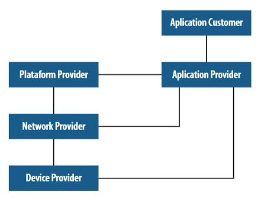
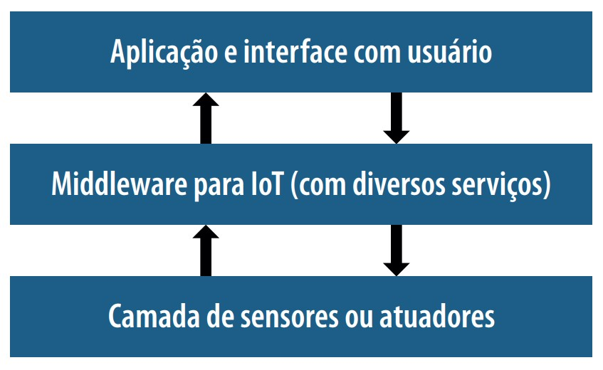

# Unidade 04 - Internet das Coisas e Big Data

## O que é IoT?

É o termo que se refere a interconexão digital de objetos cotidianos com a internet, conexão dos objetos mais do que das pessoas, ou seja, é uma rede de objetos físicos capaz de reunir e retransmitir dados. Está extremamente ligado com os termos: **Computação úbiqua ou pervasiva**, que refere-se a onipresença da computação, mesmo que essa seja pouco perceptível ou invisível.

IoT é definida como uma infraestrutura de rede global, interconectando física e virtualmente objetos, com o objetivo de explorar dados capturados e suas capacidades de comunicação.

## Ecossistema de IoT proposto pelo Itu-T

_Modelo de ecossistema para IoT proposto por ITU-T (2005)_

_Fonte: ITU-T (2005)_

- **Device Provider**: é responsável pelo fornecimento de dados brutos e/ou o conteúdo para provedores de rede e provedores de aplicação, de acordo com a lógica de negócio

- **Network Provider**: tem papel central e possui as seguintes funções:

  - Integração e acesso de recursos providos por outros provedores
  - Controle e suporte das capacidades de infraestrutura de IoT
  - Oferecer capacidades de IoT, incluindo as redes de exposição de recursos para outros provedores

- **Plataform Provider**: provê capacidades de integração e interfaces abertas.As capacidades de plataforma incluem as capacidades de integrações como: armazenamento, processamento de dados ou gestão de dispositivos e suporte para diferentes tipos de aplicações de IoT

- **Application Provider**: provê e usa capacidades ou recursos fornecidos por provedores de rede, de dispositivos e de plataformas, de modo a prover aplicações de IoT para aplicações clientes

- **Application customer**: é o user das aplicações IoT fornecidas pelos provedores de aplicação de usuário, nesse caso, uma aplicação cliente representa múltiplas aplicações de usuário.

## Tipos de Dispositivos em IoT

IoT se refere a próxima geração da internet, onde praticamente todas as coisas estarão presentes. Cada _"coisa"_ é um nó conectado na rede e que possui identificação única, partindo de dispositivos com alto poder de computacional como supercomputadores e clusters, passando por dispositivos limitados, mas com algum poder computacional como sensores, até items com baixo poder computacional ou puramente passivos.

1. **Objetos puramente passivos** com identificação única e dados fixos
2. **Objetos dotados de moderado poder computacional** e percepção de contexto
3. **Objetos que possuem conectividade em rede**, sem a intervenção humana, possibilitando a emergência de inteligência nos sistemas de rede.

### Captura e processamento de dados em IoT

1. Os dados são gerados por dispositivos físicos
2. Os dados são capturados por dispositivos chamados de interrogador ou gateway
3. Os dados são enviados ao sistema de gerenciamento de informação e são processados. Durante o processamento, novos dados são obtidos via internet, esse podem ser relacionados aos dados iniciais ou aos dispositivos de origem.
4. Como resultado do processamento, obtem-se alguma intervenção no ambiente físico onde oos dispositivos estão presentes, ou nos próprios dispositivos.

## Big Data e Aplicações IoT

Considera-se em IoT, uma grande rede com muitos nós de onde os dados serão originados. Esse volume de dados será processado por camadas intermediárias (middleware) que tratarão os dados e assim, poderá se obter informações em aplicações com interfaces compreensíveis ao usuário final.

Desse modo, tem-se a seguinte arquitetura:

_Fonte: Apostila Unidade 04 - Big Data - Universidade Cruzeiro do Sul_

| Principais Aplicações IoT      | Exemplos                                                                |
| ------------------------------ | ----------------------------------------------------------------------- |
| Casas inteligente              | Compras automatizadas                                                   |
| Vida assistida                 | Logística inteligente                                                   |
| Aplicações médicas             | Monitoramento de vida animal                                            |
| Indústrias inteligentes        | Cenários para estimação, alertas e recuperação de desastres naturais    |
| Segurança e controle de acesso | Uso de energia elétrica, água e/ou gás                                  |
| Carros inteligentes            | Ambientes inteligentes com monitoramento e controle de gasto de energia |
| Tráfego inteligente            | Sistemas de entretenimento inteligente                                  |
| Cidades inteligentes           | Sistemas para agricultura inteligente                                   |

## Referências

- [Iot - Wikipedia](https://pt.wikipedia.org/wiki/Internet_das_coisas)
- [Computação Ubíqua - Wikipedia](https://pt.wikipedia.org/wiki/Computa%C3%A7%C3%A3o_ub%C3%ADqua)
